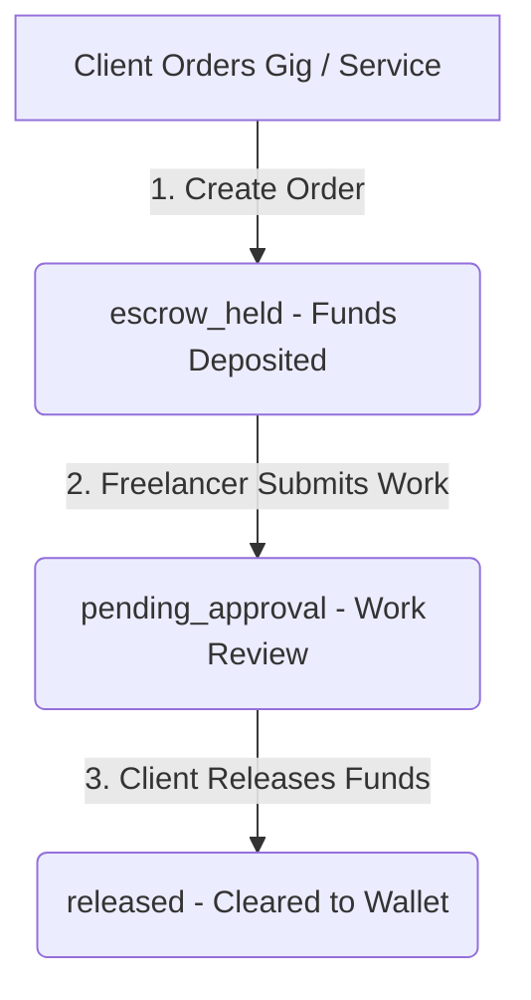

# Kazify - Upkazi Freelance Marketplace Architecture Clone

Kazify is a premium freelance marketplace scaffold clone of Upkazi. It is designed to connect global clients with vetted African talent.

This project implements a fully functional frontend sandbox in **React (Vite) + TypeScript + Tailwind CSS** with client-side simulated state machines (stored in `localStorage`) for managing job postings, bids, and secure escrow deposits and payouts.

---

## 🛠️ Tech Stack & Features

* **Frontend**: React (Vite) + TypeScript
* **Styling**: Tailwind CSS + Custom premium glassmorphism utility classes
* **Icons**: Lucide React
* **State Management**: Client-side React Context Providers:
  1. `AuthContext` - Simulated multi-persona login, user switching, and client/freelancer onboarding.
  2. `MarketplaceContext` - Search filters, category sorting, posting new shoutout job requests.
  3. `OrderContext` - Securing payments, work deliveries, and clearing funds out of escrow.

---

## 🔄 Escrow Transaction State Flow

The platform simulates a secure escrow system:


1. **escrow_held**: Client places an order, depositing payment into Kazify Escrow. Freelancer is notified it is safe to start work.
2. **pending_approval**: Freelancer completes the tasks, adds a submission note, and uploads delivery files.
3. **released**: Client inspects the delivered files and clicks "Approve Work", which releases payment to the freelancer's wallet.

---

## 🚀 How to Run Locally

Once Node.js is installed on your local machine:

1. **Install Dependencies**:
   ```bash
   npm install
   ```

2. **Start Dev Server**:
   ```bash
   npm run dev
   ```
   *The application will boot up at `http://localhost:3000`.*

---

## 🧪 Step-by-Step Simulation Sandbox Guide

To test the multi-persona flows in this browser sandbox:

1. **Sign Up or Use Mock Profiles**:
   * Out of the box, you are logged in as **Sarah Mwangi** (a Client).
   * You can open the **Identity Simulator Widget** (the ⚡ swap icon in the top right of the navbar) to change your role at any time.

2. **Post a Shoutout Job Request**:
   * Ensure you are in **Client Mode** (e.g. Sarah Mwangi).
   * Click **Post Request** on the right side of the homepage.
   * Fill out the title, budget, timeline, and category, then submit. It will immediately show up in the **Shoutouts Feed**.

3. **Bid as a Freelancer**:
   * Switch your identity to a freelancer profile (e.g. **Koffi Mensah**) using the Identity Switcher.
   * View the posted request in the feed, set your offer, and click **Bid**.

4. **Buy a Service & Secure Escrow**:
   * Switch to a Client profile.
   * Click on any Gig service card on the home page (e.g. "Modern Brand Identity Design").
   * Choose a tier (Basic, Standard, Premium) and click **Secure Payment & Order**.
   * You will be redirected to the **Order Simulation Page** `/order/:id` with the status set to `escrow_held` (Funds secured).

5. **Deliver & Release Payment**:
   * Switch to the Freelancer assigned to that gig (e.g. **Chioma Nwachukwu**).
   * Type in a delivery note and attach a mock file preview, then click **Deliver Project**. The status advances to `pending_approval`.
   * Switch back to the Client (e.g. **Sarah Mwangi**).
   * Click **Approve Work & Release Payment**. The status changes to `released` and payment is completed.
